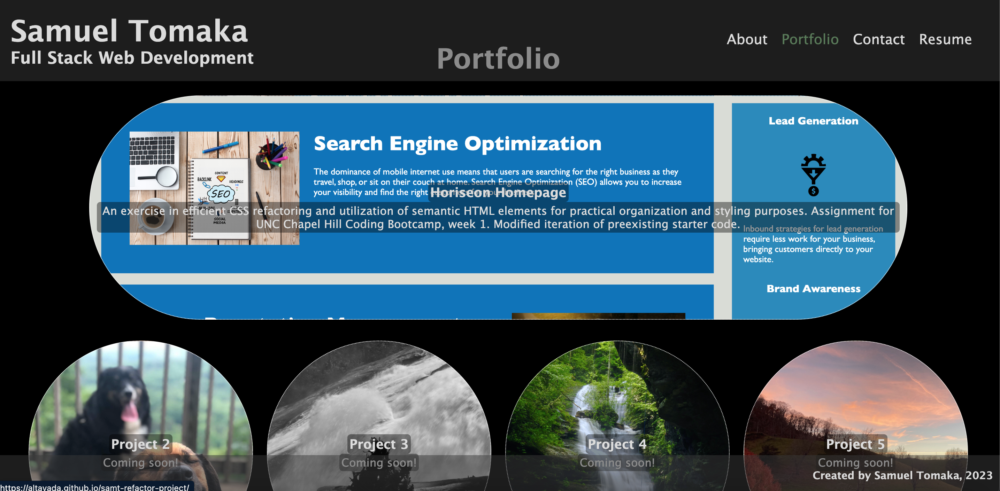

# Portfolio With React

# Description
This major upgrade to my developer portfolio showcases the power of React in UI/UX design. This particular design minimizes scrolling while also eliminating the need for page reloads, yielding a fast, clean, and responsive webpage. 
## Table of Contents
1. [Installation](#installation)
2. [Usage](#usage)
3. [License](#license)
4. [Contributors](#contributors)
5. [Questions](#questions)
# Installation
Simply visit the page [here](https://altavada.github.io/portfolio-with-react/).
# Usage
Cycle through the nav-bar tabs to get the full experience. Note that the Resume section has a mock React form, demonstrating some basic validation and alert functionality possible through React.
# License
The MIT License
# Contributors
N/A
# Questions
GitHub username: altavada -- Email address: sam.tomaka@gmail.com